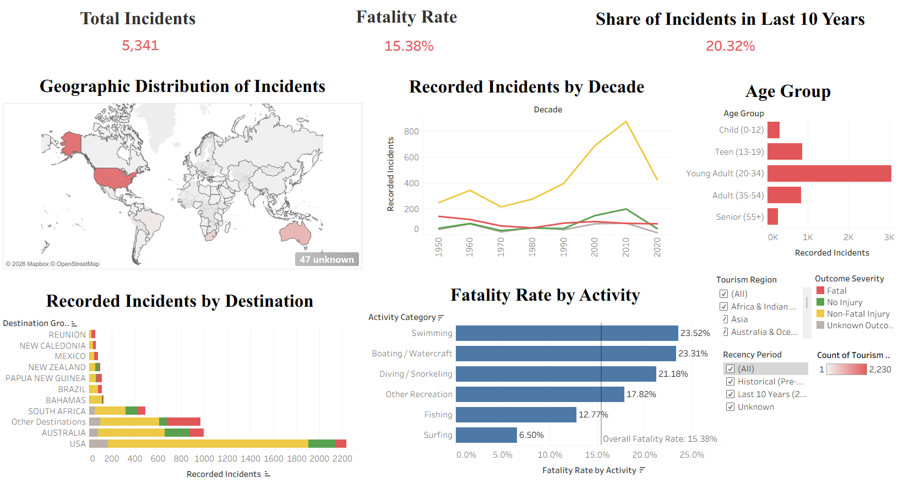

# Shark Attacks Analysis

## Project Overview

This project analyses global shark attack incidents using data analysis and Tableau visualisation. The analysis explores patterns in shark attacks across activities, destinations, age groups, time periods, and outcome severity.

The project aims to identify patterns in shark attack frequency and fatality rates and present the findings through an interactive Tableau dashboard.

## Objectives

- Analyse the overall number of recorded shark attack incidents.
- Examine fatality rates across different activities.
- Identify destinations with the highest number of recorded incidents.
- Analyse shark attack trends across decades.
- Explore incidents across different age groups.
- Compare fatal and non-fatal outcomes by activity.
- Identify patterns that may help highlight higher-risk activities and locations.

## Dataset

The analysis uses the **Global Shark Attack File (GSAF)** dataset.

Two versions of the dataset are included:

- `GSAF5.xls` – Original dataset.
- `GSAF_Cleaned (1).xlsx` – Cleaned and transformed dataset used for analysis and visualisation.

## Data Preparation

The dataset was cleaned and transformed before being used in Tableau. This included preparing variables for analysis and creating categories such as:

- Activity Category
- Age Group
- Outcome Severity
- Destination Group
- Tourism Region
- Recency Period
- Fatality indicators

Missing or unknown values were retained where appropriate to avoid unnecessarily removing records from the analysis.

## Tableau Dashboard

The Tableau dashboard provides an interactive overview of shark attack patterns.



### Dashboard Components

- **Total Incidents** – Overall number of recorded incidents.
- **Fatality Rate** – Overall proportion of incidents resulting in fatalities.
- **Share of Incidents in Last 10 Years** – Recent incident share.
- **Geographic Distribution** – Global distribution of recorded incidents.
- **Recorded Incidents by Decade** – Historical trends over time.
- **Age Group** – Distribution of incidents by age.
- **Recorded Incidents by Destination** – Comparison of major destinations.
- **Fatality Rate by Activity** – Comparison of fatality rates across activities.
- **Incident Severity by Activity** – Fatal, non-fatal and no-injury outcomes by activity.

  ## Interactive Tableau Dashboard

  https://public.tableau.com/views/Shark_Attack_Analysis_17881800166610/Dashboard1?:language=en-US&publish=yes&:sid=&:redirect=auth&:display_count=n&:origin=viz_share_link

## Key Findings

The dashboard highlights several patterns:

- Swimming and boating/watercraft have the highest fatality rates among the analysed activity categories.
- Diving/snorkeling and other recreation also show relatively high fatality rates.
- Surfing has the lowest fatality rate among the main activity categories analysed.
- Young adults account for the largest share of recorded incidents by age group.
- The United States has the highest number of recorded incidents among the destinations shown.
- Recorded incidents increased substantially in recent decades, with the highest levels visible around the 2000–2010 period.

## Tools Used

- **Microsoft Excel** – Data cleaning and preparation
- **Tableau** – Data visualisation and dashboard development
- **GitHub** – Project documentation and version control

## Repository Structure

```text
shark-attacks-analysis/
│
├── data/
│   ├── GSAF5.xls
│   └── GSAF_Cleaned.xlsx
│
├── tableau/
│   └── Shark_Attack_Analysis.twbx
│
├── screenshots/
│   └── dashboard.png
│
└── README.md
